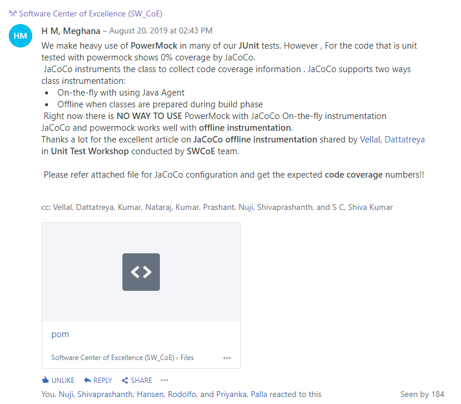

# Evidence: 20190820 JUnit OfflineInstrumentation Powermock

> Verified Artifact Evidence: `20190820_JUnit_OfflineInstrumentation_Powermock.PNG`

## Metadata
- **Filename:** `20190820_JUnit_OfflineInstrumentation_Powermock.PNG`
- **Type:** Image Verification Evidence
- **Directory:** `Philips Office Informal Feedbacks`
