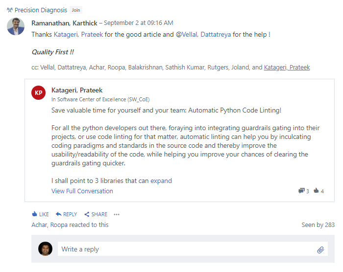

# Evidence: 20200902 QualityAtDesk PythonAutoLinting

> Verified Artifact Evidence: `20200902_QualityAtDesk_PythonAutoLinting.PNG`

## Metadata
- **Filename:** `20200902_QualityAtDesk_PythonAutoLinting.PNG`
- **Type:** Image Verification Evidence
- **Directory:** `Philips Office Informal Feedbacks`
