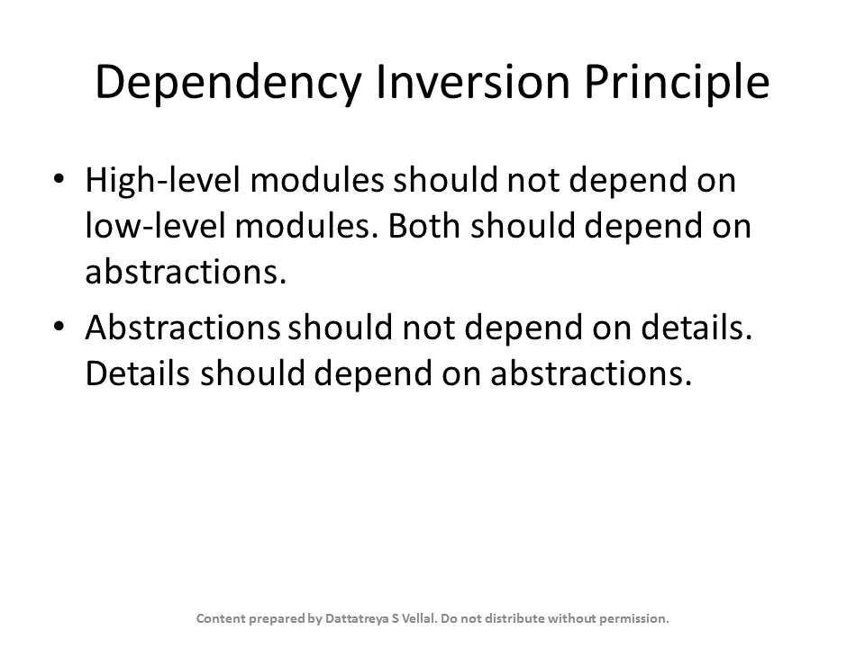

# Evidence: Slide24

> Verified Artifact Evidence: `Slide24.PNG`

## Metadata
- **Filename:** `Slide24.PNG`
- **Type:** Image Verification Evidence
- **Directory:** `Notes - SOLID Principles of OO design & programming`
